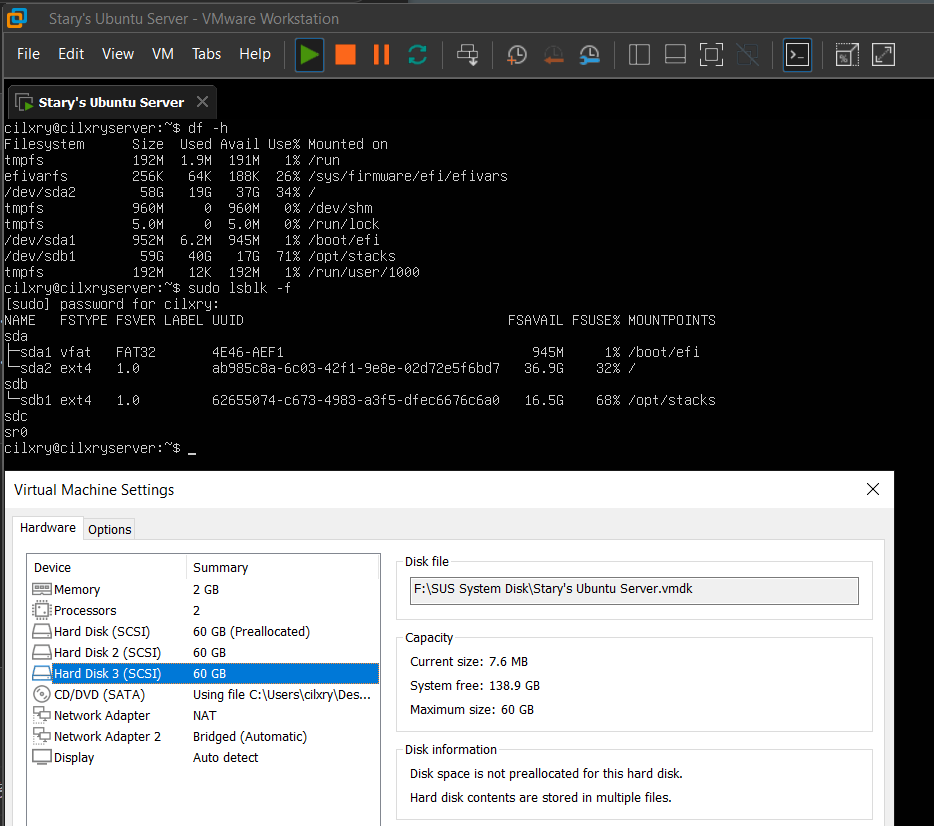

# 记迁移 Ubuntu Server

因为觉得预分配的虚拟机磁盘空间太大，
有点浪费，于是将磁盘转移成随数据增长的磁盘格式。
现记录将 Ubuntu 系统迁移到另一个磁盘的步骤

## 确认环境和准备环境

这是迁移前的三个硬盘：


首先 **重启到 LiveCD** 下（ Try or install Ubuntu ），**进入终端**
（**以下步骤假设以 root 身份运行的终端，若不是，运行 `sudo su` 即可**）

> 进入终端的方式：
>
> Desktop：`Ctrl` + `Alt` + `T`
> Server：右上角 `Help`，其中的 `Enter Shell`

**再次确认磁盘和分区**
可以看到 `sda` `sdb` `sdc` 三个磁盘

接着记下： **根分区**、 **EFI 分区** 和 **目标磁盘**
比如这是：`/dev/sda2` `/dev/sda1` 和 `/dev/sdc`

## 分区

在这里使用 **fdisk** 来分区

```bash
fdisk /dev/sdc
```

接下来根据情况来分区：

```bash
# Command:
g # 创建 GPT 分区表

# Command:
n # 新建分区

# Partition number(1):
1 # 分区号，默认直接回车就好

# First sector(2048):
2048 # 起始扇区

# Last sector(125827071):
+512M # 这个是问分区大小的
# Created a new partition 1

# Command:
t # 修改分区类型

# 如果要选择分区，就选择 1
# 这里因为现在只有一个分区，所以直接选择了
# Selected partition 1
# Partition type:
1 # 设置为 EFI（输 L 可以查看）

# Command:
# 第二分区步骤和一分区相同
# 在 Last Sector 直接回车可以选择剩下所有空间

# Command:
w # 写入磁盘
```

**再看 lsblk 的结果**，就能看到 sdc 下有 **两个分区** 了

```bash
sdc
|-sdc1
`-sdc2
```

## 格式化分区

```bash
mkfs.vfat -F 32 /dev/sdc1
mkfs.ext4 -L root /dev/sdb2 # L 标志是给分区加标签
```

检查：

```bash
lsblk -f /dev/sdc
```

就会有： **vfat 的 sdc1** 和 **ext4 的 sdc2**

## 挂载系统

**挂载原系统分区和目标分去**

```bash
# 创建挂载点
mkdir -p /mnt/src /mnt/dst

# 挂载源（原系统）
mount /dev/sda2 /mnt/src          # 挂载根分区
mount /dev/sda1 /mnt/src/boot/efi # 如果是 UEFI，挂载 EFI

# 挂载目标（新系统）
mount /dev/sdc2 /mnt/dst
mkdir -p /mnt/dst/boot/efi        # 确保目录存在
mount /dev/sdc1 /mnt/dst/boot/efi # 挂载新 EFI
```

## rsync

```bash
rsync -aAXHxv --numeric-ids --exclude={"/dev/*","/proc/*","/sys/*","/tmp/*","/run/*","/mnt/*","/media/*","/lost+found"} /mnt/src/ /mnt/dst/
```

| 参数            | 作用                                                  |
| --------------- | ----------------------------------------------------- |
| `-a`            | 归档模式（保留权限、时间、符号链接等）                |
| `-A`            | 保留 ACL（访问控制列表）                              |
| `-X`            | 保留扩展属性（如 SELinux 标签）                       |
| `-H`            | 保留硬链接（重要！避免文件重复拷贝）                  |
| `-x`            | 不跨越文件系统（比如不会复制 /home 如果它是单独分区） |
| `-v`            | 显示过程                                              |
| `--numeric-ids` | 不尝试解析用户 / 组名（ Live 系统用户 ID 可能不同 ）  |

## 等

等待就好。

## 准备 chroot 和进入系统

挂载 **必要的虚拟文件系统** 到目标系统：

```bash
mount --bind /dev /mnt/dev
mount --bind /proc /mnt/proc
mount --bind /sys /mnt/sys

chroot /mnt/
```

### 坑

接下来装引导的过程中，如果 AI 让你用 `apt install --reinstall grub`，
**别用** **别重装** **一定别重装**
重装 Grub 不需要重新安装 apt 包

### 正确的方式

```bash
grub-install /dev/sdc
update-grub
exit

# 卸载分区
umount -R /mnt/src
umount -R /mnt/dst
```
