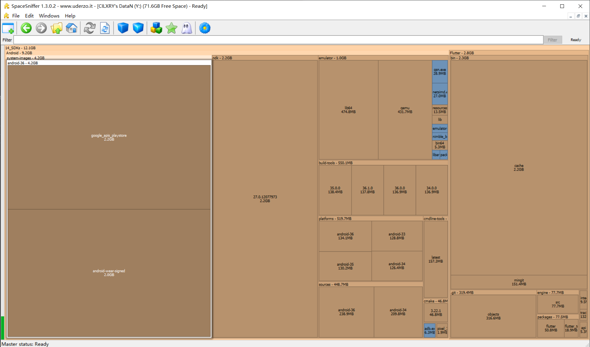

一段时间搁置 flutter 和 unity 的开发，
故在此记录如要重新开发，应该需要怎么重新部署

## 当前的环境

Windows 10 22H2 19045.6466
Unity 2022.3.62f2c1

```bash
C:\Users\cilxry>flutter --version
Flutter 3.35.7 • channel stable • https://github.com/flutter/flutter.git
Framework • revision adc9010625 (4 months ago) • 2025-10-21 14:16:03 -0400
Engine • hash 6b24e1b529bc46df7ff397667502719a2a8b6b72 (revision 035316565a) (3 months ago) • 2025-10-21 14:28:01.000Z
Tools • Dart 3.9.2 • DevTools 2.48.0

C:\Users\cilxry>flutter doctor -v
[√] Flutter (Channel stable, 3.35.7, on Microsoft Windows [ 版本 10.0.19045.6466], locale en-US) [315ms]
    • Flutter version 3.35.7 on channel stable at Y:\14_SDKs\Flutter
    • Upstream repository https://github.com/flutter/flutter.git
    • Framework revision adc9010625 (4 months ago), 2025-10-21 14:16:03 -0400
    • Engine revision 035316565a
    • Dart version 3.9.2
    • DevTools version 2.48.0
    • Feature flags: enable-web, enable-linux-desktop, enable-macos-desktop, no-enable-windows-desktop, enable-android,
      no-enable-ios, cli-animations, enable-lldb-debugging

[√] Windows Version (10 家庭版 64-bit, 22H2, 2009) [5.5s]

[√] Android toolchain - develop for Android devices (Android SDK version 36.1.0) [4.4s]
    • Android SDK at Y:\14_SDKs\Android
    • Emulator version 35.6.11.0 (build_id 13610412) (CL:N/A)
    • Platform android-36, build-tools 36.1.0
    • Java binary at: C:\Program Files\Zulu\zulu-17\bin\java
      This JDK is specified by the JAVA_HOME environment variable.
      To manually set the JDK path, use: `flutter config --jdk-dir="path/to/jdk"`.
    • Java version OpenJDK Runtime Environment Zulu17.62+17-CA (build 17.0.17+10-LTS)
    • All Android licenses accepted.

[√] Chrome - develop for the web [16ms]
    • Chrome at C:\Program Files\Google\Chrome\Application\chrome.exe

[!] Android Studio (not installed) [15ms]
    • Android Studio not found; download from https://developer.android.com/studio/index.html
      (or visit https://flutter.dev/to/windows-android-setup for detailed instructions).

[√] VS Code (version 1.108.2) [15ms]
    • VS Code at C:\Users\cilxry\AppData\Local\Programs\Microsoft VS Code
    • Flutter extension version 3.128.0

[√] Connected device (2 available) [1,570ms]
    • Chrome (web) • chrome • web-javascript • Google Chrome 144.0.7559.110
    • Edge (web)   • edge   • web-javascript • Microsoft Edge 144.0.3719.104

[!] Network resources [21.3s]
    X A network error occurred while checking "https://maven.google.com/": 信号灯超时时间已到


! Doctor found issues in 2 categories.

C:\Users\cilxry>
```

## Unity

算简单的，在 Unity 官网上下载 Unity Hub 就可以下了
IDE 的话可以用 Rider 或者 VS Code

[Unity Hub Download](https://unity.com/cn/download)
[Rider Download](https://www.jetbrains.com/zh-cn/rider/)

别看错了， **2022** 或以后的版本，别看成 2020 了
一个版本大概 6GB（以 2022.3.62f2c1 为例）

## Flutter

算是稍微有点麻烦的，
因为 FlutterSDK 对应安卓开发的 SDK 和 NDK
不要有想着 “复用 SDK 和 NDK” 的想法

安卓工具链比较方便的方式是在 Android Studio 里下载
下载完卸载掉 AS 就可以
NDK（以 27.0.12077973 为例）占用 2.2G
其余 SDK 和工具链占 3G 左右
系统镜像下了 a36 的 Android 和 WearOS 4.2G
更具体占用如图：

[Flutter Quick Start](https://docs.flutter.cn/get-started/quick)
[Android Studio](https://developer.android.google.cn/studio?hl=zh-cn)

下载完之后要记得将 Flutter **设置为环境变量**（具体见教程）

## 呃以及

记得开梯子，不然 as 下不下来 sdk，你会卡在 timeout 那里，或者就是卡在万恶的 gradle 那（不过在 build 第一次之后就不用了）

在下载完 Android SDK 之后，要在 flutter 手动指定 SDK 路径和同意协议